# Software Requirements Specification (SRS)
# FOTON Unit Monitoring System

**Versi:** 2.0  
**Tanggal:** 2026-03-15  
**Status:** Draft

---

## 1. Pendahuluan

Dokumen ini mendefinisikan persyaratan arsitektur, fungsionalitas, keamanan, dan hak akses (*Roles*) untuk pembangunan ulang aplikasi **FOTON Unit Monitoring System**. Aplikasi ini akan bertransisi dari tumpukan (stack) *Frontend React + Base44 Cloud* menuju arsitektur berdaulat mandiri menggunakan kerangka **PHP Laravel (Monolitik)** dengan *database* **MySQL Lokal**.

---

## 2. Arsitektur Sistem (Technical Stack)

Aplikasi didesain secara Monolitik (*Monolith*) di mana Lapis *Backend* dan *Frontend* digabungkan ke dalam satu wadah *project* untuk memudahkan *deployment* di server kantor.

| Layer | Teknologi |
|-------|-----------|
| **Frontend (UI)** | React.js + Tailwind CSS + shadcn/ui |
| **Adapter** | Inertia.js (menghubungkan React ke Laravel tanpa REST API terpisah) |
| **Backend** | PHP v8.x + Laravel v11.x (Router, Controller, Eloquent ORM) |
| **Auth** | Sesi PHP Laravel + UUID sebagai session identifier (mencegah IDOR) |
| **Database** | MySQL v8.x dengan fitur `JSON Column` untuk spesifikasi dinamis |
| **Real-time** | Polling setiap 5 detik via React Query, siap upgrade ke Laravel Reverb WebSocket |

---

## 3. Sistem Role & Hierarki Akses

### 3.1 Prinsip Dasar

Aplikasi menggunakan **Role-Based Access Control (RBAC)** dengan prinsip:

1. **Field Team** hanya bisa mengerjakan tugasnya sesuai state yang ditugaskan — tidak bisa kelola akun apapun
2. **Sales** mengelola field team di phase/state mereka + dashboard phase 1 & 4
3. **After Sales Head (`as_head`)** adalah "Mini COO" khusus lingkup After Sales — import unit, kelola semua akun AS, akses semua dashboard AS, bisa handle trouble & God Mode dalam scope After Sales
4. **After Sales Workshop (`as_workshop`)** mengelola operasional karoseri & PDI (State 4–7)
5. **After Sales Technical (`as_technical`)** menangani seluruh trouble dari semua state
6. **COO** adalah God Mode — akses penuh ke semua dashboard dan kelola akun Sales & After Sales Head

> **Tidak ada role "admin"** dalam sistem ini. Fungsi administratif didelegasikan sesuai hierarki di atas.

---

### 3.2 Hierarki Lengkap

```
COO  (God Mode — akses menyeluruh)
│
├── SALES
│   ├── Kelola akun: Forwarder, Gudang, KEUR, Ekspedisi, Driver, PIC Sales
│   └── Dashboard: monitor unit CBU 1–3 & 10–14 / CKD 1–5 & 12–15
│       ├── Forwarder        → CBU State 1, 2, 3 / CKD State 1
│       ├── NA               → CKD State 2, 3
│       ├── Dealer           → CKD State 4, 5
│       ├── Gudang           → CBU State 10, 12 / CKD State 12, 14
│       ├── KEUR (keur)      → CBU State 11 / CKD State 13
│       └── Ekspedisi/Driver → CBU State 13, 14 / CKD State 15
│
└── AFTER SALES HEAD (as_head) — "Mini COO" khusus After Sales
    ├── Import unit Excel
    ├── Handle trouble (semua state)
    ├── God Mode dalam scope After Sales
    ├── Kelola akun: as_workshop, as_technical, Karoseri, Foreman
    │
    ├── AS WORKSHOP (as_workshop)
    │   └── Dashboard: monitor unit
    │       ├── CBU: State 4–9 (Karoseri 0%→100% + PDI)
    │       └── CKD: State 2, 6–11 (NA PDI + Karoseri 0%→100% + PDI)
    │
    └── AS TECHNICAL (as_technical)
        └── Handle semua trouble CBU State 1–14 / CKD State 1–15
```

### 3.3 Tabel Hak Akses per Role

| Role | Dashboard | Kelola Akun | Hak Istimewa |
|------|-----------|-------------|---------------|
| `coo` | Semua (Sales + After Sales + Field Team) | `sales`, `as_head` | God Mode penuh, Import/Export |
| `sales` | CBU 1–3 & 10–14 / CKD 1–5 & 12–15 | `forwarder`, `gudang`, `keur`, `ekspedisi`, `driver`, PIC Sales | — |
| `as_head` | Semua dashboard After Sales | `as_workshop`, `as_technical`, `karoseri`, `foreman` | Import unit, handle trouble, God Mode scope AS |
| `as_workshop` | CBU State 4–9 / CKD State 2 & 6–11 | `karoseri`, `foreman` | Generate link mobile |
| `as_technical` | Trouble semua state | — | Handle trouble |
| `forwarder` | — | — | CBU: State 1, 2, 3 / CKD: State 1 |
| `karoseri` | — | — | CBU: State 4–8 / CKD: State 6–10 (milestone 0%→100%) |
| `foreman` | — | — | CBU: State 9 / CKD: State 11 (QC/PDI) |
| `gudang` | — | — | CBU: State 10, 12 / CKD: State 12, 14 |
| `keur` | — | — | CBU: State 11 / CKD: State 13 (Uji sertifikasi — Lolos/Tidak Lolos) |
| `ekspedisi` / `driver` | — | — | CBU: State 13, 14 / CKD: State 15 |
| `na` | — | — | CKD: State 2 (PDI di NA), State 3 (Keluar ke Dealer) |
| `dealer` | — | — | CKD: State 4 (Dealer), State 5 (Keluar ke Karoseri) |

---

## 4. Sistem Autentikasi & Login

### 4.1 Mekanisme Login (Opsi A — Single Login URL)

Semua pengguna menggunakan **satu halaman login** yang sama:

```
URL: /login  (atau /MobileUpdate untuk field team via link)
```

**Alur Login:**
```
[Pengguna buka halaman login]
        ↓
[Masukkan Kode Akses]
        ↓
[Sistem validasi kode → cek role di tabel access_codes]
        ↓
┌────────────────────────────────────────┐
│ Role?                                   │
├──────────┬──────────┬──────────────────┤
│ coo      │ sales    │ after_sales      │ → Redirect: /dashboard/[role]
├──────────┤          │                  │
│         field team (forwarder, dll)    │ → Redirect: /mobile (halaman update state)
└────────────────────────────────────────┘
```

**Field Team** mendapatkan link langsung dengan kode tersemat:
```
https://[domain]/MobileUpdate?code=XXXXXXXX
```
Link ini di-generate oleh Sales (untuk field team mereka) atau After Sales (untuk field team mereka).

### 4.2 Perlindungan Akun COO

- Akun COO **tidak bisa diubah** oleh Sales atau After Sales
- Hanya COO sendiri yang bisa mengubah kode aksesnya sendiri
- Akun COO dijaga di level aplikasi (middleware check)

### 4.3 Tabel `access_codes`

| Field | Tipe | Keterangan |
|-------|------|------------|
| `id` | UUID (PK) | Primary key |
| `code` | VARCHAR(50) | Kode akses unik |
| `name` | VARCHAR(200) | Nama pengguna |
| `role` | ENUM | Lihat daftar role di §3.3 |
| `phone` | VARCHAR(20) | Nomor WhatsApp |
| `division` | VARCHAR(100) | Divisi (misal: Technical) |
| `location` | VARCHAR(100) | Lokasi/area kerja |
| `is_active` | BOOLEAN | Status aktif |
| `last_access` | DATETIME | Timestamp login terakhir |
| `created_by` | UUID (FK) | ID pembuat akun |

---

## 5. Use Case Diagram

```mermaid
flowchart TD
    %% =================== AKTOR ===================
    FT(["👷 Field Team\n─────────────────\nForwarder\nNA\nDealer\nKaroseri\nForeman\nGudang\nKEUR (Petugas Uji)\nEkspedisi / Driver"])
    SALES(["🔵 Sales"])
    AS(["🟣 After Sales"])
    COO(["🔴 COO\n(God Mode)"])

    %% =================== USE CASES ===================
    subgraph UC_AUTH ["🔐 Autentikasi"]
        LOGIN["Login via Kode Akses"]
        REDIRECT["Auto-Redirect ke Dashboard Sesuai Role"]
    end

    subgraph UC_FIELD ["📱 Field Team — Mobile"]
        SCAN["Scan SIN / Input VIN"]
        UPDATE["Update State Unit"]
        PDI["Isi Form PDI\n(Foreman Only)"]
        TROUBLE_RPT["Lapor Trouble"]
    end

    subgraph UC_SALES ["🔵 Sales Dashboard"]
        S_DASH["Pantau Unit\nCBU: State 1–3 & 10–14\nCKD: State 1–5 & 12–15"]
        S_KPI["Lihat KPI & Progress\nPhase 1 dan Phase 4"]
        S_ACC["Kelola Akun\nForwarder, Gudang, KEUR\nEkspedisi, Driver, PIC Sales"]
        S_LINK["Generate Link Mobile\nUntuk Field Team"]
        S_EXPORT["Export Excel BAST\n(Filter Tanggal, Tipe, Karoseri)"]
    end

    subgraph UC_AS ["🟣 After Sales"]
        subgraph UC_AS_HEAD ["👑 as_head — After Sales Head"]
            AH_IMPORT["Import Unit Excel"]
            AH_ACC["Kelola Akun\nas_workshop, as_technical,\nKaroseri, Foreman"]
            AH_GOD["God Mode Scope AS\n(Edit State Manual)"]
            AH_TROUBLE["Handle Trouble\n(Semua State)"]
        end
        subgraph UC_AS_WO ["A — as_workshop: Workshop Operation"]
            A_DASH["Pantau Unit State 4–9\n(Karoseri & PDI)"]
            A_KPI["KPI Progress Karoseri\n0% / 25% / 50% / 75% / 100% + PDI"]
            A_LINK["Generate Link Mobile\nUntuk Field Team"]
        end
        subgraph UC_AS_TECH ["B — as_technical: Technical (HO)"]
            T_RESP["Beri Instruksi / ho_response\n(Semua Trouble CBU 1–14 / CKD 1–15)"]
            T_SOLVE["Tandai Trouble Selesai\n+ Isi Solusi"]
        end
    end

    subgraph UC_COO ["🔴 COO — Dashboard Menyeluruh"]
        C_ALL["Pantau Semua Unit\n(Semua State)"]
        C_SALES_VIEW["Lihat Dashboard Sales"]
        C_AS_VIEW["Lihat Dashboard After Sales"]
        C_ACC["Kelola Akun Sales\n& After Sales"]
        C_GOD["Update State Bebas\n(God Mode — Bypass Semua Aturan)"]
        C_IMPORT["Import & Export\nData Unit (Excel)"]
    end

    subgraph UC_TROUBLE ["⚠️ Trouble — Dilaporkan Field Team"]
        T_NOTIF["Lapor Trouble + Foto\n+ Kronologi + Lokasi"]
        T_LOCK["Unit Terkunci (Trouble Lock)\nTidak Bisa Update State"]
    end

    %% =================== KONEKSI ===================
    FT --> LOGIN
    SALES --> LOGIN
    AS --> LOGIN
    COO --> LOGIN
    LOGIN --> REDIRECT

    FT --> SCAN --> UPDATE
    FT --> PDI
    FT --> T_NOTIF --> T_LOCK

    SALES --> S_DASH
    SALES --> S_KPI
    SALES --> S_ACC
    SALES --> S_LINK
    SALES --> S_EXPORT

    AS --> AH_IMPORT
    AS --> AH_ACC
    AS --> AH_GOD
    AS --> AH_TROUBLE
    AS --> A_DASH
    AS --> A_KPI
    AS --> A_LINK
    AS --> T_RESP
    AS --> T_SOLVE

    COO --> C_ALL
    COO --> C_SALES_VIEW
    COO --> C_AS_VIEW
    COO --> C_ACC
    COO --> C_GOD
    COO --> C_IMPORT
    COO --> T_RESP
    COO --> T_SOLVE
```



---

## 6. Alur Progres Unit (State Pipeline)

### 6.1 Alur CBU (Completely Built-Up) — 15 States (State 0–14)

Setiap update state dilakukan dengan **Scan SIN** (Stiker Identifikasi Kendaraan yang ditempel saat unit tiba di Priok).

```
State 0 → 1 → 2 → 3 → [4→5→6→7→8→9] → 10  → 11   → 12 → 13  → 14
  Priok   Forwarder    ←── After Sales ──→  Gudang  KEUR  Gudang  Ekspedisi  SELESAI
          (Sales)      Karoseri 0-100% PDI  Masuk   Uji   Keluar
```

| State | Nama | Role | Foto Wajib | Keterangan | Dashboard |
|-------|------|------|------------|------------|-----------|
| 0 | Di Priok | — | — | Belum keluar pabrik | Sales |
| 1 | Keluar Pabrik/Priok | `forwarder` | ✅ | | Sales |
| 2 | Foto Tiba di Karoseri | `forwarder` | ✅ | | Sales |
| 3 | Tiba di Karoseri | `forwarder` | ✅ | | Sales |
| 4 | Karoseri 0% | `karoseri` | ✅ | Mulai pengerjaan | After Sales |
| 5 | Karoseri 25% | `karoseri` | ✅ | Bak naik chassis | After Sales |
| 6 | Karoseri 50% | `karoseri` | ✅ | Aksesoris (side guard, back guard, frame tangga) | After Sales |
| 7 | Karoseri 75% | `karoseri` | ✅ | Painting luar dalam bak | After Sales |
| 8 | Karoseri 100% | `karoseri` | ✅ | Finishing & wiring (lampu, sensor parkir) | After Sales |
| 9 | QC / PDI | `foreman` | ✅ | Lihat PDI Fork | After Sales |
| 10 | Gudang Masuk | `gudang` | ✅ | Konfirmasi unit masuk gudang | Sales |
| 11 | KEUR | `keur` | ✅ | Uji sertifikasi kendaraan — **Lolos / Tidak Lolos** | Sales |
| 12 | Gudang Keluar | `gudang` | ✅ | Konfirmasi unit keluar gudang | Sales |
| 13 | Keluar ke Customer | `ekspedisi`, `driver` | ✅ | Perjalanan ke customer | Sales |
| 14 | SELESAI | `ekspedisi`, `driver` | ✅ + Alamat + BAST | Foto BAST + Alamat lengkap | Sales |

**Catatan State 0 (Di Priok):**
Sebelum State 1, unit sudah ada di sistem (diimport via Excel) tapi belum dikonfirmasi keluar. Aktivitas di Priok:
- Buka kontainer
- General Inspection (GI)
- Penempelan Stiker SIN (Stiker Identifikasi Kendaraan)

### 6.2 Alur CKD (Completely Knocked-Down) — 16 States (State 0–15)

> **CKD juga mulai dari Priok** — unit CKD dikirim dalam kondisi terurai (knocked-down) via kontainer ke Priok, lalu forwarder bawa ke NA (fasilitas perakitan), baru setelah dirakit dikirim ke Dealer.

```
St 0 → 1    → 2     → 3    → 4  → 5    → [6→7→8→9→10→11] → 12  → 13  → 14 → 15
 Priok  Fwd   PDI di  Keluar  Dealer Keluar  ←─ After Sales ─→  Gudang KEUR  Gudang  DO
        ke NA   NA    ke      →      ke Karo  Karoseri 0-100% + PDI  Masuk  Uji  Keluar SELESAI
                     Dealer         seri
```

| State | Nama | Role | Foto Wajib | Keterangan | Dashboard |
|-------|------|------|------------|------------|-----------|
| 0 | Di Priok | — | — | Belum keluar pabrik | Sales |
| 1 | Keluar Priok ke NA | `forwarder` | ✅ | Pengiriman CKD ke fasilitas perakitan | Sales |
| 2 | PDI di NA | `na` | ✅ | Perakitan + inspeksi awal | After Sales |
| 3 | Keluar ke Dealer | `na`, `dealer` | ✅ | | Sales |
| 4 | Dealer | `dealer` | ✅ | | Sales |
| 5 | Keluar ke Karoseri | `dealer`, `karoseri` | ✅ | | Sales |
| 6 | Karoseri 0% | `karoseri` | ✅ | Mulai pengerjaan | After Sales |
| 7 | Karoseri 25% | `karoseri` | ✅ | Bak naik chassis | After Sales |
| 8 | Karoseri 50% | `karoseri` | ✅ | Aksesoris (side guard, back guard, frame tangga) | After Sales |
| 9 | Karoseri 75% | `karoseri` | ✅ | Painting luar dalam bak | After Sales |
| 10 | Karoseri 100% | `karoseri` | ✅ | Finishing & wiring (lampu, sensor parkir) | After Sales |
| 11 | QC / PDI | `foreman` | ✅ | | After Sales |
| 12 | Gudang Masuk | `gudang` | ✅ | Konfirmasi unit masuk gudang | Sales |
| 13 | KEUR | `keur` | ✅ | Uji sertifikasi kendaraan — **Lolos / Tidak Lolos** | Sales |
| 14 | Gudang Keluar | `gudang` | ✅ | Konfirmasi unit keluar gudang | Sales |
| 15 | DO / Keluar ke Customer (SELESAI) | `ekspedisi`, `driver` | ✅ + Alamat + BAST | Foto BAST + Alamat lengkap | Sales |

### 6.3 Aturan State (Sistem Tongkat Estafet)

1. **Estafet Sequential** — Role hanya bisa update ke state berikutnya dari posisi saat ini. Tidak bisa loncat state.
2. **Trouble Lock** — Jika unit memiliki trouble berstatus `open` atau `waiting_ho`, tombol update **dikunci**. Unit harus menyelesaikan trouble dahulu.
3. **PDI Fork:**
   - ✅ PDI Good → state lanjut normal
   - ❌ PDI Not Good → wajib buat laporan Trouble, state tidak bisa maju
4. **State 14 CBU / State 15 CKD (SELESAI)** — Wajib mengisi: Foto BAST + Alamat (Provinsi, Kota, Alamat Lengkap)
5. **Gudang Wajib 3 Tahap (CBU & CKD)** — Setelah PDI, unit wajib melewati:
   - State Gudang Masuk (`gudang`) → State KEUR (`keur`) → State Gudang Keluar (`gudang`)
   - CKD: State 12 → 13 → 14; CBU: State 10 → 11 → 12
   - Tidak bisa loncat, sequential ketat untuk semua unit.
6. **KEUR Fork:**
   - ✅ Lolos → state lanjut ke Gudang Keluar
   - ❌ Tidak Lolos → wajib buat laporan Trouble, unit dikunci sampai trouble `solved`
7. **Timestamp Wajib** — Setiap update state **wajib mencatat jam dan tanggal** (format: DD/MM/YYYY HH:mm). Tampil di riwayat unit dan history dashboard.
8. **Anti-Double State Update** — Sistem mencegah double submit state:
   - **Backend:** Sebelum menerima update, validasi `current_state` unit di database. Jika state yang dikirim bukan `current_state + 1`, request **ditolak** dengan pesan error.
   - **Frontend:** Setelah berhasil submit, tombol update langsung **di-disable** dan tampil status *"✅ Sudah diupdate"*. Tombol tidak muncul lagi kecuali ada state baru yang perlu diisi.
   - **Idempotency:** Setiap request update state membawa `expected_state` (state yang diharapkan), backend menolak jika `current_state` unit berbeda.

---

## 7. Dashboard Spesifikasi

### 7.1 Dashboard Sales

**Akses:** Role `sales` dan `coo`

**Konten:**
| Komponen | Deskripsi |
|----------|-----------|
| KPI Cards | Total unit di phase Sales (State 1-3 & 8-11), completed, trouble |
| Flow Overview | Visualisasi jumlah unit per-state di Phase 1 & 4 |
| Unit Table | Tabel unit dengan filter state, search VIN |
| Detail Unit | Lihat info lengkap unit termasuk technical specs |
| History | Riwayat update state per unit |
| Trouble Snapshot | Trouble aktif di unit-unit fase Sales |
| Manajemen Akun | Buat/edit/nonaktifkan akun: Forwarder, Gudang, Ekspedisi, Driver, PIC Sales |
| Generate Link | Buat link mobile untuk field team |

**Filter State yang tampil:**
- CBU: State 1, 2, 3, 10, 11, 12, 13, 14
- CKD: State 1, 2, 3, 4, 5, 12, 13, 14, 15

---

### 7.2 Dashboard After Sales

After Sales terbagi menjadi **3 role** dengan dashboard masing-masing:

---

#### 👑 as_head — After Sales Head ("Mini COO" Scope AS)

**Akses:** Role `as_head` dan `coo`

| Komponen | Deskripsi |
|----------|-----------|
| Sales View AS | Embed dashboard Workshop & Technical |
| KPI Global AS | KPI semua unit After Sales tanpa filter |
| Import/Export Excel | Upload template unit, download report |
| Manajemen Akun AS | Buat/edit akun `as_workshop`, `as_technical`, `karoseri`, `foreman` |
| God Mode Scope AS | Edit state unit manual dalam lingkup After Sales |
| Handle Trouble | Bisa beri instruksi & selesaikan trouble (semua state) |

---

#### A — as_workshop: Workshop Operation

**Akses:** Role `as_workshop`, `as_head`, dan `coo`

Menangani operasional proses fisik unit di karoseri dan PDI.

| Komponen | Deskripsi |
|----------|-----------|
| KPI Cards | Total unit di State 4–9, PDI status (passed/failed/pending) |
| Flow Overview | Visualisasi progress karoseri: 0% → 25% → 50% → 75% → 100% → PDI |
| Karoseri Panel | Unit per karoseri + progress pengerjaan + aging alert |
| Unit Table | Tabel unit dengan filter state, karoseri, progress (0/25/50/75/100%) |
| PDI Summary | Ringkasan hasil PDI: passed/failed/pending per unit |
| Generate Link | Buat link mobile untuk Karoseri & Foreman |

**Filter State yang tampil (Workshop Operation):**
- CBU: State 4, 5, 6, 7, 8, 9
- CKD: State 2 (PDI di NA) dan State 6, 7, 8, 9, 10, 11

---

#### B — as_technical: Technical (Home Office)

**Akses:** Role `as_technical`, `as_head`, dan `coo`

Menangani seluruh **Trouble Handling** dari **semua state 1–14** (CBU) dan **1–15** (CKD).

| Komponen | Deskripsi |
|----------|-----------|
| Trouble List | Semua trouble aktif dari SEMUA state & SEMUA unit |
| Filter Trouble | Filter by status: `open`, `waiting_ho`, `solved` |
| Detail Trouble | Lihat foto, kronologi, lokasi, rute pelapor |
| Beri Instruksi | Isi `ho_response` → status berubah ke `waiting_ho` |
| Selesaikan Trouble | Isi `solution` → status berubah ke `solved` → unit `active` kembali |
| Trouble History | Riwayat trouble yang sudah solved |

> **as_technical** dan **as_head** (selain COO) yang bisa memberikan instruksi dan menyelesaikan trouble — berapapun state unit saat trouble terjadi.

---

### 7.3 Dashboard COO (Menyeluruh)

**Akses:** Role `coo` saja

**Konten:**
| Komponen | Deskripsi |
|----------|-----------|
| Sales View | Embed/tab Dashboard Sales |
| After Sales View | Embed/tab Dashboard After Sales |
| KPI Global | KPI semua unit tanpa filter |
| Trouble Menyeluruh | Semua trouble dari semua phase |
| Import/Export Excel | Upload template unit, download report |
| Manajemen Akun COO | Buat/edit akun Sales & After Sales |
| FlowEdit (God Mode) | Edit state unit secara manual, bypass semua aturan |
| Training Guide | Panduan penggunaan sistem |

> ⚠️ **Tidak ada "Summary" tab** — digantikan oleh Sales View dan After Sales View.

---

## 8. Modul Manajemen Akun

### 8.1 Siapa Bisa Buat Akun Siapa

| Yang Membuat | Role yang Bisa Dibuat |
|-------------|----------------------|
| `coo` | `sales`, `as_head` |
| `sales` | `forwarder`, `gudang`, `keur`, `ekspedisi`, `driver`, PIC `sales` |
| `as_head` | `as_workshop`, `as_technical`, `karoseri`, `foreman` |
| `as_workshop` | `karoseri`, `foreman` (generate link saja, tidak buat akun baru) |
| `as_technical` | ❌ Tidak bisa buat akun |
| Field Team | ❌ Tidak bisa buat akun |

### 8.2 Fitur Manajemen Akun

- **Buat akun baru** — isi nama, role, kode akses, nomor HP
- **Generate kode akses** — auto-generate kode random 8 karakter
- **Copy link mobile** — salin link lapangan siap kirim via WA
- **Aktif/nonaktif akun** — toggle tanpa hapus data
- **Ubah kode akses** — hanya bisa ubah akun yang berada di bawah hierarkinya
- **COO tidak bisa diedit** oleh Sales atau After Sales

---

## 9. Modul Data Master & Import

### 9.1 File Template Resmi: `template_import_unit.xlsx`

Role `as_head` dan `coo` **wajib** menggunakan template ini untuk upload unit baru ke sistem. Template tersedia via tombol **"⬇ Download Template"** di dashboard masing-masing.

**Kolom Wajib:**

| Kolom | Validasi |
|-------|----------|
| `VIN` | Unik, 17 karakter, uppercase |
| `Engine No` | Wajib isi |
| `Unit Type` | Hanya: `CBU` atau `CKD` |
| `Model` | Wajib isi |
| `Warna` | Wajib isi |

**Kolom Spesifikasi (Spec:) — Opsional:**

Semua kolom ber-prefix `Spec:` bersifat opsional, sistem simpan `null` jika kosong.

Format header: `Spec: KATEGORI: Nama Field`  
Contoh: `Spec: ENGINE: Type` → tersimpan sebagai `{"ENGINE": {"Type": "Diesel"}}`

**Pipeline Import:**
```
Upload .xlsx
  → Baca header kolom
  → Kolom tanpa "Spec:" → kolom biasa di tabel units
  → Kolom "Spec:" → dipecah jadi nested JSON → disimpan ke kolom technical_specs
  → VIN sudah ada → UPDATE | VIN baru → INSERT
  → Tampilkan ringkasan: X berhasil, Y gagal + download log error
```

### 9.2 Daftar Kolom Spesifikasi Lengkap

| No | Header Kolom Excel | Contoh Nilai |
|----|-------------------|--------------| 
| 1 | `Spec: MODEL: Drive System` | BJ1088VEJEA-FR |
| 2 | `Spec: ENGINE: Make & Model` | Cummins ISF3.8s4R154 |
| 3 | `Spec: ENGINE: Type` | Diesel, Turbocharged, Intercooled, Four-Stroke |
| 4 | `Spec: ENGINE: Number of Cylinders` | 4 Cylinders In-Line |
| 5 | `Spec: ENGINE: Displacement (L)` | 3.76 |
| 6 | `Spec: ENGINE: Rated Max. Output` | 154 PS (115kW) @ 2,600 rpm |
| 7 | `Spec: ENGINE: Rated Max. Torque` | 500 N-m (50.9kg-m) @ 1,200-1,900 rpm |
| 8 | `Spec: ENGINE: Emission Level` | Euro 4 |
| 9 | `Spec: ENGINE: Fuel Injection System` | ECU Controlled, Bosch |
| 10 | `Spec: TRANSMISSION: Model` | ZF6S506TO |
| 11 | `Spec: TRANSMISSION: Type` | 6-Speed Manual |
| 12 | `Spec: TRANSMISSION: Gear Ratio 1st` | 6.198 |
| 13 | `Spec: TRANSMISSION: Gear Ratio 2nd` | 3.287 |
| 14 | `Spec: TRANSMISSION: Gear Ratio 3rd` | 2.025 |
| 15 | `Spec: TRANSMISSION: Gear Ratio 4th` | 1.371 |
| 16 | `Spec: TRANSMISSION: Gear Ratio 5th` | 1.000 |
| 17 | `Spec: TRANSMISSION: Gear Ratio 6th` | 0.780 *(kosong jika 5-speed)* |
| 18 | `Spec: TRANSMISSION: Gear Ratio Reverse` | 5.681 |
| 19 | `Spec: TRANSMISSION: Gear Ratio Final` | 4.333 |
| 20 | `Spec: WEIGHT: Gross Vehicle Weight (kg)` | 8,250 |
| 21 | `Spec: WEIGHT: Curb Weight Rear All Model (kg)` | 2,995 |
| 22 | `Spec: WEIGHT: Curb Weight Front (kg)` | 1,860 |
| 23 | `Spec: WEIGHT: Curb Weight Rear (kg)` | 1,135 |
| 24 | `Spec: WEIGHT: Fuel Tank Capacity (l)` | 200 |
| 25 | `Spec: AXLE: Front Type` | Reversed Elliot, I-Beam |
| 26 | `Spec: AXLE: Front Axle Design Capacity (kg)` | 4,000 |
| 27 | `Spec: AXLE: Rear Type` | Banjo Type, Full Floating |
| 28 | `Spec: AXLE: Rear Axle Design Capacity (kg)` | 6,500 |
| 29 | `Spec: SUSPENSION: Front` | 8-Leaf Spring with Hydraulic Shock Absorber |
| 30 | `Spec: SUSPENSION: Rear` | 8+6-Leaf Spring with Hydraulic Shock Absorber |
| 31 | `Spec: TYRES & WHEELS: Tyres` | 7.50R16 |
| 32 | `Spec: TYRES & WHEELS: Wheels` | 16 x 6.00 |
| 33 | `Spec: BRAKES: Service` | Air Braking Dual Circuit with ABS |
| 34 | `Spec: BRAKES: Parking Brake Type` | Pneumatic Controlled Spring Brake |
| 35 | `Spec: BRAKES: Auxiliary` | Exhaust Brake |
| 36 | `Spec: STEERING: System` | Hydraulic Power Assisted |
| 37 | `Spec: STEERING: Min. Turning Radius (m)` | 6.7 |
| 38 | `Spec: ELECTRICAL: Battery` | 24V, 100 AH, 2pcs |
| 39 | `Spec: DIMENSION: Wheelbase (mm)` | 3,360 |
| 40 | `Spec: DIMENSION: Overall Length (mm)` | 5,960 |
| 41 | `Spec: DIMENSION: Overall Width (mm)` | 2,030 |
| 42 | `Spec: DIMENSION: Overall Height (mm)` | 2,260 |
| 43 | `Spec: DIMENSION: Front Overhang (mm)` | 1,110 |
| 44 | `Spec: DIMENSION: Rear Overhang (mm)` | 1,420 |
| 45 | `Spec: DIMENSION: Front Tread (mm)` | 1,590 |
| 46 | `Spec: DIMENSION: Rear Tread (mm)` | 1,534 |

---

## 10. Modul Trouble Handling

> **Penting:** Seluruh trouble dari **semua state (CBU: 1–14 / CKD: 1–15)** ditangani oleh **After Sales divisi Technical**. Sales hanya melihat trouble di dashboardnya sebagai informasi, tetapi **tidak berwenang** memberi instruksi atau menyelesaikan trouble.

### 10.1 Alur Status Trouble

```
[Field Team]          [After Sales Technical / COO]
     │                          │
     ▼                          ▼
  open ──── notifikasi ───► waiting_ho ──── instruksi ───► solved
 (lapor)    ke sistem HO    (beri arahan)   + solusi      (unit active)
```

| Status | Siapa Aksi | Yang Dilakukan |
|--------|------------|----------------|
| `open` | **Field Team** | Lapor trouble: tipe, kronologi, foto, lokasi |
| `waiting_ho` | **After Sales Technical** atau **COO** | Beri instruksi via field `ho_response` |
| `solved` | **After Sales Technical** atau **COO** | Isi `solution` → selesaikan → unit kembali `active` |

### 10.2 Form Laporan Trouble (Field Team — Mobile)

Wajib diisi:
- **Tipe Trouble** — dropdown: `driver`, `karoseri`, `gudang`, `transit`
- **Rute** — dari mana ke mana kejadiannya
- **Kronologi / Deskripsi** — narasi selengkap mungkin
- **Foto Dashboard** — foto odometer/dashboard unit wajib
- **Foto Kerusakan** — opsional
- **Lokasi Trouble** — kota/alamat kejadian

> Trouble bisa dilaporkan dari **state mana saja** (CBU: 1–14 / CKD: 1–15). Khusus **KEUR**: jika Tidak Lolos, otomatis membuat trouble dan mengunci unit.

### 10.3 Trouble Lock

Jika unit punya trouble berstatus `open` atau `waiting_ho`:
- Tombol update state di mobile **dikunci**
- Banner merah muncul: *"🔒 Update Dikunci — Trouble Aktif"*
- Unit tidak bisa maju ke state berikutnya sampai trouble `solved`

### 10.4 Anti-Double Input Trouble

Sistem mencegah double input trouble untuk VIN yang sama oleh role yang sama.

#### Alur saat Field Team input VIN di halaman Trouble:

```
Input VIN
    │
    ▼
 Apakah unit punya trouble AKTIF (open/waiting_ho)?
    │
    ├── YA, dari role yang SAMA
    │       └→ Tampilkan trouble existing dalam mode UPDATE
    │           Banner: "⚠️ Kamu sudah melaporkan trouble ini pada [tgl jam].
    │                    Klik untuk update laporan."
    │           Tombol: [Update Laporan] — bukan form baru
    │
    └── TIDAK (tidak ada trouble aktif, atau sebelumnya sudah SOLVED)
            └→ Tampilkan form trouble baru (CREATE)
```

#### Aturan:
1. **1 unit = maks 1 trouble aktif** pada satu waktu (status `open` atau `waiting_ho`)
2. **Trouble berbeda di state berbeda diperbolehkan** — trouble forwarder yang sudah `solved`, lalu di karoseri ada trouble baru → ini trouble terpisah dan boleh dibuat
3. **Semua trouble tersimpan sebagai riwayat** — tidak ada yang dihapus atau ditimpa
4. **Backend validation:** Sebelum `INSERT` trouble baru, cek apakah ada trouble dengan `unit_id` yang sama dan status `open` atau `waiting_ho`. Jika ada, return `409 Conflict`.
5. **Frontend:** Saat field team scan/input VIN di halaman trouble, sistem langsung cek status trouble aktif dan tampilkan UI yang sesuai (CREATE atau UPDATE mode)

### 10.5 Riwayat Trouble

- Semua trouble (termasuk yang sudah `solved`) tersimpan permanen
- Bisa dilihat di **Detail Unit** pada dashboard
- Diurutkan dari yang terbaru
- Riwayat trouble tidak bisa diedit atau dihapus oleh siapapun

---

## 11. Export Excel BAST

### 11.1 Deskripsi

Fitur export untuk menghasilkan file **Excel (.xlsx)** berisi data unit yang sudah SELESAI, lengkap dengan foto BAST dan foto PDI yang tertanam (embed) di dalam file.

### 11.2 Filter Export

Sebelum export, user dapat memfilter data berdasarkan:

| Filter | Opsi |
|--------|------|
| **Tanggal** | Pilih hari, bulan, tahun (range tanggal SELESAI) |
| **Tipe Unit** | CBU / CKD / Semua |
| **Karoseri** | Pilih vendor karoseri atau Semua |
| **Status** | SELESAI saja (default) |

> Tombol **"Export Excel"** hanya aktif setelah filter dipilih.

### 11.3 Kolom di File Excel

| Kolom | Keterangan |
|-------|------------|
| VIN | Nomor identifikasi kendaraan |
| Engine No | Nomor mesin |
| Tipe | CBU / CKD |
| Model | Model unit |
| Karoseri | Vendor karoseri |
| Tgl Masuk | Tanggal unit di-import ke sistem |
| Tgl PDI | Tanggal & jam QC/PDI selesai |
| Tgl Selesai | Tanggal & jam unit SELESAI |
| Provinsi | Lokasi serah terima |
| Kota | Lokasi serah terima |
| Alamat | Alamat lengkap serah terima |
| Foto PDI | Gambar/foto PDI (embed di Excel) |
| Foto BAST | Gambar/foto surat terima unit (embed di Excel) |

### 11.4 Format File

- Format: **Excel (.xlsx)**
- Gambar ter-embed langsung di dalam sel / baris yang sesuai
- Nama file otomatis: `BAST_Export_[TglAwal]_[TglAkhir].xlsx`
- Foto yang gagal diambil akan diganti placeholder teks: `[Foto tidak tersedia]`

> **Kenapa Excel bukan CSV?** CSV tidak mendukung gambar. Excel (.xlsx) mendukung embed gambar sehingga laporan bisa langsung diprint atau difilter tanpa kehilangan visual.

---

## 12. Export Excel Trouble

### 12.1 Deskripsi

Fitur export khusus **dashboard Trouble** (as_technical, as_head, COO) untuk menghasilkan file **Excel (.xlsx)** berisi riwayat trouble lengkap dengan foto.

### 12.2 Filter Export Trouble

| Filter | Opsi |
|--------|------|
| **Tanggal** | Range tanggal lapor trouble |
| **Status** | `open` / `waiting_ho` / `solved` / Semua |
| **Tipe Trouble** | `driver` / `karoseri` / `gudang` / `transit` / Semua |
| **Tipe Unit** | CBU / CKD / Semua |
| **Karoseri** | Vendor karoseri atau Semua |

> Tombol **"Export Excel"** hanya aktif setelah minimal 1 filter dipilih.

### 12.3 Kolom di File Excel Trouble

| Kolom | Keterangan |
|-------|------------|
| VIN | Nomor identifikasi kendaraan |
| Model | Model unit |
| Tipe Unit | CBU / CKD |
| State Saat Trouble | Nama state saat trouble dilaporkan |
| Tipe Trouble | driver / karoseri / gudang / transit |
| Rute | Dari mana ke mana |
| Kronologi | Deskripsi kejadian |
| Lokasi | Kota/alamat kejadian |
| Foto Kerusakan | Gambar (embed, jika ada) |
| Status | open / waiting\_ho / solved |
| Instruksi HO | Isi `ho_response` dari After Sales Technical |
| Solusi | Isi `solution` saat trouble diselesaikan |
| Dilaporkan Oleh | Nama + Role pelapor |
| Tgl Lapor | Tanggal & jam trouble dilaporkan |
| Tgl Solved | Tanggal & jam trouble diselesaikan |

### 12.4 Format File

- Format: **Excel (.xlsx)**
- Foto embed di baris yang sesuai (jika ada)
- Nama file otomatis: `Trouble_Export_[TglAwal]_[TglAkhir].xlsx`
- Foto tidak tersedia → teks `[Foto tidak tersedia]`

---

## 12. Modul Part Code (Spare Parts)

Belum diimplementasikan di frontend. Akan dibangun di backend Laravel.

| Field | Tipe | Keterangan |
|-------|------|------------|
| `id` | UUID | Primary Key |
| `part_code` | VARCHAR(50) | Kode unik (cth: `ISF38-FAN-001`) |
| `part_name` | VARCHAR(200) | Nama komponen |
| `category` | VARCHAR(100) | Kategori (Engine, Rem, dll) |
| `is_active` | BOOLEAN | Aktif/nonaktif |

- Dikelola COO dari dashboard
- Di form trouble, field team bisa input Part Code → **auto-complete** menampilkan nama
- Satu trouble bisa punya **lebih dari 1 part rusak** (tabel `trouble_items`)

---

## 12. Database Schema Utama

### 12.1 Tabel `units`

| Field | Tipe | Keterangan |
|-------|------|------------|
| `id` | UUID (PK) | |
| `vin` | VARCHAR(17) UNIQUE | Vehicle Identification Number |
| `engine_number` | VARCHAR(50) | Nomor mesin |
| `unit_type` | ENUM(CBU,CKD) | |
| `model` | VARCHAR(100) | |
| `color` | VARCHAR(50) | |
| `current_state` | TINYINT | 0–14 CBU / 0–15 CKD |
| `current_location` | VARCHAR(100) | |
| `progress_percent` | TINYINT | 0, 25, 50, 75, 100 (milestone karoseri) |
| `status` | ENUM(active, completed, trouble) | |
| `forwarder` | VARCHAR(100) | |
| `delivery_letter` | VARCHAR(100) | Nomor surat jalan |
| `driver_name` | VARCHAR(100) | |
| `driver_phone` | VARCHAR(20) | |
| `dealer` | VARCHAR(100) | |
| `karoseri` | VARCHAR(100) | |
| `karoseri_entry_date` | DATE | |
| `pic_name` | VARCHAR(100) | |
| `customer_name` | VARCHAR(100) | |
| `entry_date` | DATE | |
| `estimated_completion` | DATE | |
| `completion_date` | DATE | |
| `photos` | JSON | Array URL foto |
| `pdi_status` | ENUM(pending, passed, failed) | |
| `pdi_date` | DATE | |
| `pdi_foreman` | VARCHAR(100) | |
| `pdi_notes` | TEXT | |
| `pdi_checklist` | JSON | {engine_ok, brake_ok, electrical_ok, body_ok, ac_ok, tyre_ok, fuel_ok, document_ok} |
| `pdi_photos` | JSON | Array URL foto PDI |
| `technical_specs` | JSON | Nested JSON spesifikasi teknis |

### 12.2 Tabel `unit_histories`

| Field | Keterangan |
|-------|------------|
| `id` | UUID (PK) |
| `unit_id` | FK ke units |
| `vin` | VIN unit |
| `state` | Nomor state yang dicapai |
| `state_name` | Nama state |
| `location` | Lokasi saat state ini |
| `progress_percent` | Progress % |
| `pic_name` | Nama yang update |
| `pic_role` | Role yang update |
| `notes` | Catatan + alamat (untuk state SELESAI) |
| `photos` | JSON — URL foto |
| `created_at` | Timestamp otomatis |

---

## 13. Real-Time & Auto Refresh

- Dashboard polling **setiap 60 detik** via React Query `refetchInterval: 60000`
- Tombol **Manual Refresh** wajib ada dengan timestamp terakhir refresh
- Polling **hanya aktif di halaman dashboard** — tidak di halaman lain
- Saat field team update state → user bisa klik Manual Refresh atau tunggu 60 detik
- Siap upgrade ke **Laravel Reverb (WebSocket)** tanpa perubahan arsitektur besar

> **Kenapa 60 detik?** 30 user polling tiap 5 detik = 360 request/menit hanya dari dashboard. Dengan 60 detik = 30 request/menit. Jauh lebih hemat resource server.

---

## 14. Catatan Migrasi (Base44 → Laravel)

| Komponen | Sekarang (Base44) | Target (Laravel) |
|----------|-------------------|------------------|
| Auth | `base44.entities.AccessCode.list()` | Session + Middleware Laravel |
| CRUD | `base44.entities.X.list/create/update/delete` | Eloquent + Controller |
| File Upload | `base44.integrations.Core.UploadFile()` | Laravel Storage (local/S3) |
| Real-time | `base44.entities.X.subscribe()` | Polling 60 detik + Manual Refresh |
| Routing | React SPA + BrowserRouter | Inertia.js + Laravel Router |
| UUID | Auto dari Base44 | `Str::uuid()` Laravel + DB UUID PK |

---

## 15. Technical Constraints (Server Optimization)

Sistem dirancang untuk berjalan pada **shared hosting maupun VPS** dengan resource terbatas. Seluruh implementasi wajib memperhatikan efisiensi berikut:

### 15.1 Polling & Request

| Aturan | Implementasi |
|--------|--------------|
| Polling 60 detik | `refetchInterval: 60000` di React Query |
| Polling hanya di dashboard | Matikan polling di halaman non-dashboard |
| Tombol Manual Refresh | Wajib ada di semua dashboard |

### 15.2 Upload File

| Aturan | Implementasi |
|--------|--------------|
| Batas ukuran | Max **5 MB** per foto, validasi di frontend + backend |
| Auto compress | Resize & compress via PHP GD / Intervention Image sebelum disimpan |
| Nama file | Random: `Str::random(16) . '_' . time() . '.jpg'` — tidak boleh nama asli |
| Validasi tipe | Hanya `jpg`, `jpeg`, `png`, `webp` — validasi MIME type, bukan hanya ekstensi |
| Struktur folder | `/storage/app/public/photos/{vin}/{state}/` |

### 15.3 Database & Query

| Aturan | Implementasi |
|--------|--------------|
| Pagination | Max **20 unit per halaman** di semua tabel dashboard |
| Index wajib | Kolom `vin`, `current_state`, `status`, `unit_type` harus di-index |
| Eager loading | Gunakan `with()` untuk relasi — hindari N+1 query |
| Select spesifik | Hindari `SELECT *` — ambil kolom yang dibutuhkan saja |

### 15.4 Import Excel

| Aturan | Implementasi |
|--------|--------------|
| Batas baris | Max **200 baris** per file upload |
| Proses batch | Gunakan chunk/batch agar tidak timeout |
| Validasi dulu | Validasi semua baris sebelum insert — rollback jika ada error |
| Feedback | Tampilkan ringkasan: X berhasil, Y gagal + pesan error per baris |

### 15.5 Keamanan Mobile Link

| Aturan | Implementasi |
|--------|--------------|
| Panjang kode | Minimum **32 karakter** via `Str::random(32)` |
| Simpan di DB | Hash kode dengan `bcrypt` — tidak simpan plain text |
| Nonaktifkan | Toggle `is_active` per akun — link langsung tidak bisa dipakai |
| Format URL | `https://domain/m?code=XXXXXXXXXXXXXXXXXXXXXXXXXXXXXXXX` |

### 15.6 State Validation — Backend Wajib

> ⚠️ Kontrol hanya di frontend **tidak cukup** — request bisa dimanipulasi manual.

- **Middleware Laravel** validasi role dan state expected sebelum setiap update
- **Backend reject** jika state yang dikirim bukan `current_state + 1` → response `403 Forbidden`
- **API tidak bisa dipanggil** untuk loncat state (validasi di level controller/middleware)
- **God Mode COO** hanya via endpoint khusus yang dilindungi Policy Laravel

### 15.7 COO Role Security

- Semua route COO dilindungi `RoleMiddleware` + `CooPolicy`
- Double-check: **middleware level** (route) + **policy level** (action)
- Setiap action God Mode dicatat di tabel `audit_logs`

---

## 16. Panduan Deployment

### 16.1 Persiapan Sebelum Upload

```bash
# 1. Build frontend (wajib dilakukan di lokal sebelum upload)
npm run build
# → Hasilkan folder public/build/

# 2. Pastikan .env sudah diisi untuk production
#    APP_DEBUG=false, APP_ENV=production, DB_*, APP_URL
```

### 16.2 Folder yang Di-Upload ke Server

| Folder/File | Upload? | Keterangan |
|-------------|---------|------------|
| `app/` | ✅ | Logic utama |
| `bootstrap/` | ✅ | Bootstrap Laravel |
| `config/` | ✅ | Konfigurasi |
| `database/` | ✅ | Migration & seeder |
| `public/` | ✅ | **Web root/document root** |
| `public/build/` | ✅ | Hasil `npm run build` |
| `resources/` | ✅ | Views & assets source |
| `routes/` | ✅ | Definisi routes |
| `storage/` | ✅ | Folder kosong tetap perlu |
| `vendor/` | ✅ | Atau `composer install` di server |
| `.env` | ✅ | Isi konfigurasi production |
| `artisan` | ✅ | CLI Laravel |
| `composer.json` | ✅ | Dependencies list |
| `node_modules/` | ❌ | **JANGAN upload** — terlalu besar |
| `.git/` | ❌ | **JANGAN upload** |
| `package.json` | ❌ | Tidak dibutuhkan di server |

### 16.3 Langkah di Server Setelah Upload

```bash
# 1. Install dependencies PHP (jika vendor/ tidak diupload)
composer install --no-dev --optimize-autoloader

# 2. Generate app key (jika .env belum punya APP_KEY)
php artisan key:generate

# 3. Jalankan migrasi database
php artisan migrate --force

# 4. Set permission storage
chmod -R 775 storage bootstrap/cache

# 5. Cache konfigurasi untuk performa
php artisan config:cache
php artisan route:cache
php artisan view:cache
```

### 16.4 Konfigurasi Web Server

- **Document root** harus diarahkan ke folder `public/` — bukan root project
- Pastikan `.htaccess` di `public/` aktif (untuk Apache) atau konfigurasi Nginx sesuai
- URL rewriting harus aktif (`mod_rewrite` Apache / `try_files` Nginx)
